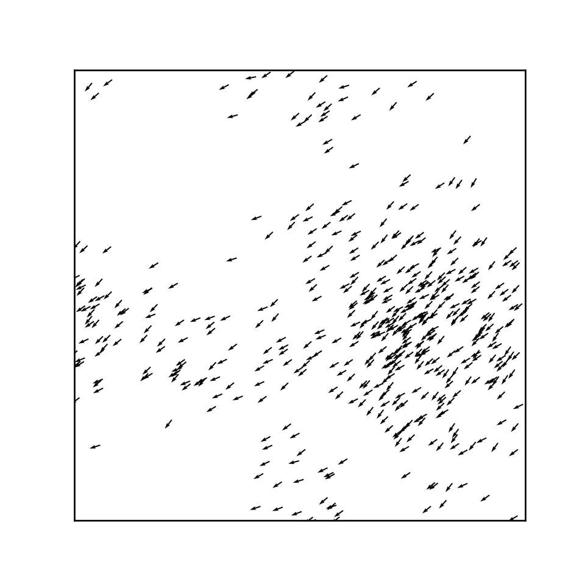

# activematter-python
Active Matter simulation

## Create Your Own Active Matter Simulation (With Python)

### Philip Mocz (2021) Princeton Univeristy, [@PMocz](https://twitter.com/PMocz)

Simulate Active Matter: Viscek model for flocking birds


```
python activematter.py
```


